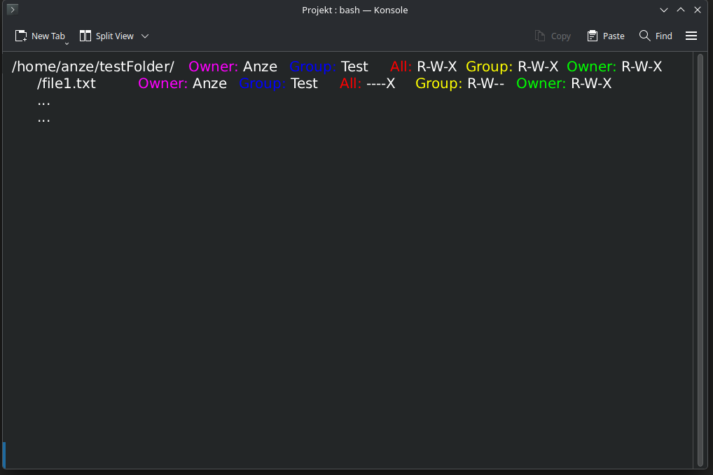
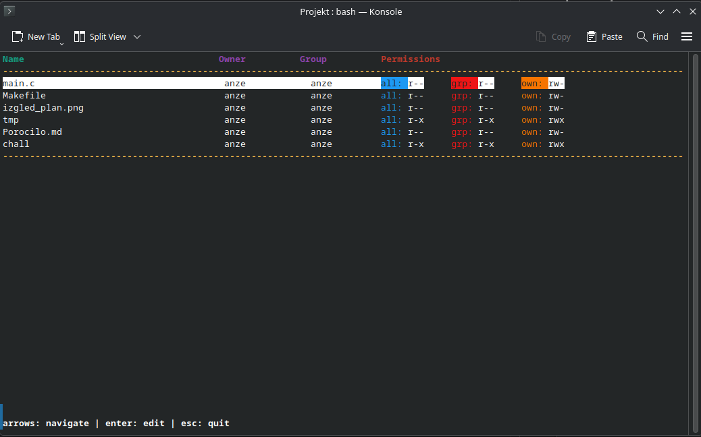

# Poročilo

## Opis
Program `chall` je TUI program ki služi preprostemu spreminjanju pravic datotek in map.
Omogoča tudi rekurzivno spreminjanje pravic imenika.

## Uporaba
`chall mapa` - odpre vse datoteke v mapi ter omogoča spreminjanje njihovih pravic

`chall -r mapa` - odpre samo mapo ampak rekurzivno spremeni vse pravice datotek v njej

Navigira se s puščicami ter ko se pride na željeno datoteko se pritisne enter to nas da v edit mode in nato se s puščicami levo desno premikamo po pravicah.

Pravice spremenimo s presledkom ter takoj ko kliknemo so pravice shranjene, ter status o tem ali je uspelo ali ne je izpisan spodaj levo.

Za izhod se lahko pritisne `esc` ali `ctrl+c`

## Uporabljeni sistemski klici
- `stat()` — pridobivanje informacij o datoteki
- `chmod()` — spreminjanje pravic
- `opendir()` / `readdir()` — branje vsebine mape
- `getpwuid()` / `getgrgid()` — pretvorba UID/GID v ime

## Konceptna slika

## Koncni rezultat
